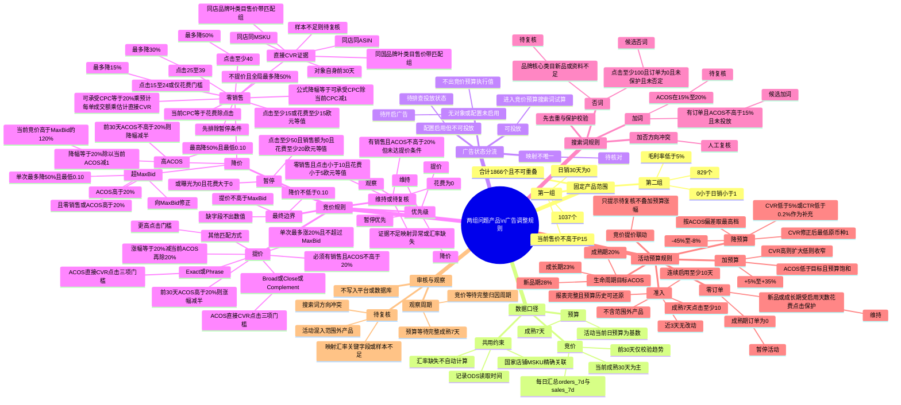

# 两组问题产品广告调整规则思维导图

> 这是 [完整规则](2026-09-14-两组问题产品广告调整完整规则.md) 的可视化索引；所有可执行条件、公式和例外仍以完整规则为准。

```mermaid
mindmap
  root((两组问题产品\n广告调整规则))
    固定产品范围
      第一组
        日销30天为0
        当前售价不高于P15
        1037个
      第二组
        0小于日销小于1
        毛利率低于5%
        829个
      合计1866个且不可重叠
    数据口径
      竞价
        当前成熟30天为主
        每日汇总orders_7d与sales_7d
        前30天仅校验趋势
      预算
        成熟7天
        活动当前日预算为基数
      共用约束
        国家店铺MSKU精确关联
        记录ODS读取时间
        汇率缺失不自动计算
    广告状态分流
      无对象或配置未启用
        待开启广告
        不出竞价预算执行值
      配置启用但不可投放
        待排查投放状态
      映射不唯一
        待核对
      可投放
        进入竞价预算搜索词试算
    竞价规则
      优先级
        暂停优先
        维持
        降价
        提价
        观察
      暂停
        点击至少50且销售额为0且花费至少20欧元等值
        或曝光为0且花费大于0
      维持或待复核
        花费为0
        零销售且点击小于10且花费小于5欧元等值
        有销售且ACOS不高于20%但未达提价条件
        证据不足映射异常或汇率缺失
      降价
        超MaxBid
          当前竞价高于MaxBid的120%
          且零销售或ACOS高于20%
          向MaxBid修正
          单次最多降50%且最低0.10
        高ACOS
          ACOS高于20%
          降幅等于20%除以当前ACOS减1
          最高降50%且最低0.10
          前30天ACOS不高于20%则降幅减半
        零销售
          先排除暂停条件
          点击至少15或花费至少15欧元等值
          当前CPC等于花费除点击
          可承受CPC等于20%乘预计每单成交额乘估计直接CVR
          公式降幅等于可承受CPC除当前CPC减1
          不提价且全局最多降50%
          点击15至24或仅花费门槛
            最多降15%
          点击25至39
            最多降30%
          点击至少40
            最多降50%
          直接CVR证据
            对象自身前30天
            同店同MSKU
            同店同ASIN
            同店品牌叶类目售价带匹配组
            同国品牌叶类目售价带匹配组
            样本不足则待复核
      提价
        必须有销售且ACOS不高于20%
        Exact或Phrase
          ACOS直接CVR点击三项门槛
        Broad或Close或Complement
          ACOS直接CVR点击三项门槛
        其他匹配方式
          更高点击门槛
        涨幅等于20%减当前ACOS再除20%
        单次最多涨20%且不超过MaxBid
        前30天ACOS高于20%则涨幅减半
      最终边界
        降价不低于0.10
        提价不高于MaxBid
        缺字段不出数值
    搜索词规则
      先去重与保护校验
      加词
        有订单且ACOS不高于15%且未投放
          候选加词
        ACOS在15%至20%
          待复核
      否词
        点击至少100且订单为0且未保护且未否定
          候选否词
        品牌核心类目新品或资料不足
          待复核
      加否方向冲突
        人工复核
    活动预算规则
      准入
        连续启用至少10天
        成熟7天点击至少10
        近3天无改动
        报表完整且预算历史可还原
        不含范围外产品
      生命周期目标ACOS
        新品期28%
        成长期23%
        成熟期20%
      零订单
        成熟期订单为0
          暂停活动
        新品或成长期受启用天数花费点击保护
          维持
      降预算
        按ACOS偏差取最高档
        -45%至-8%
        CVR低于5%或CTR低于0.2%作为补充
        CVR修正后最低原币种1
      加预算
        ACOS低于目标且预算饱和
        +5%至+35%
        CVR高则扩大低则收窄
      竞价提价联动
        只提示待复核不叠加预算涨幅
    审核与观察
      待复核
        映射汇率关键字段或样本不足
        活动混入范围外产品
        搜索词方向冲突
      观察周期
        竞价等待完整归因周期
        预算等待完整成熟7天
      不写入平台或数据库
```
