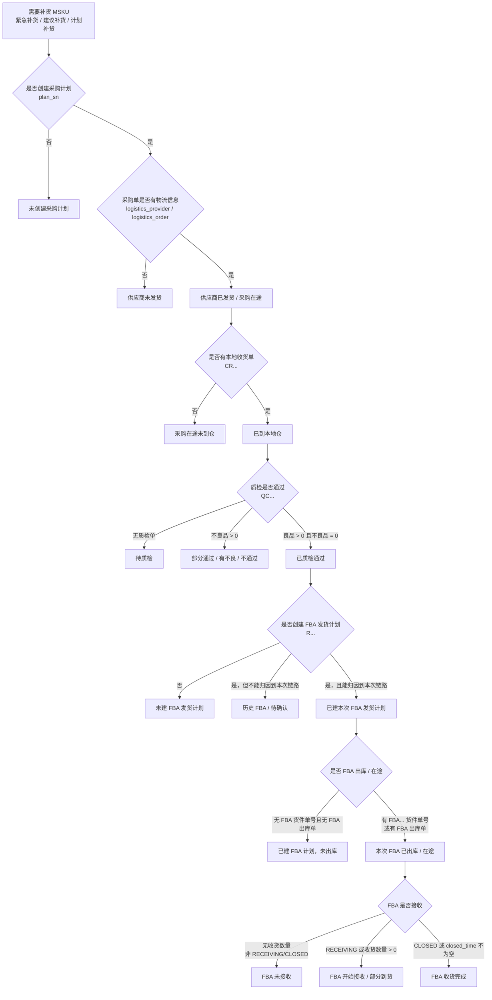

# 补货追踪链路新版梳理

本文档重新梳理补货追踪页面的链路判断。当前已确认采购计划、供应商发货、本地收货、质检、FBA 发货计划、FBA 货件/在途、FBA 接收/收货完成这几段链路。

## 结论

新版补货追踪要按真实业务动作逐段判断，不能只按 MSKU/SKU 粗匹配后续单据，否则容易把历史采购、历史 FBA 在途误判成本次补货链路。

核心结论：

| 链路 | 结论口径 |
| --- | --- |
| 1. 是否创建采购计划 | 补货后匹配到采购计划 `plan_sn` 才算已建采购计划 |
| 2. 供应商是否发货 | 采购计划对应采购单有物流商或物流单号，才算采购在途；否则为供应商未发货 |
| 3. 是否到本地仓 | 采购单匹配到收货单，且有实际收货数量，才算到本地仓 |
| 4. 质检是否通过 | 有质检单，良品数大于 0 且不良数为 0，算质检通过 |
| 5. 是否创建 FBA 发货计划 | 质检通过后匹配到 FBA 发货计划 `R...`，只代表已建计划 |
| 6. 是否 FBA 出库/在途 | 有真正 FBA 货件单号 `FBA...`，或有 FBA 出库单，才算 FBA 出库/在途 |
| 7. 是否 FBA 接收/完成 | `RECEIVING` 或收货数量大于 0 算开始接收；`CLOSED` 或 `closed_time` 不为空算收货完成 |

防误判原则：

```text
只有能串起“本次采购计划 -> 本次采购单 -> 本次收货单 -> 本次质检 -> 本次 FBA 计划 -> 本次 FBA 货件/出库”的记录，才算本次链路。
```

如果只能看到 FBA 计划、货件或出库，但前置采购/收货/质检链路断开，统一标记为：

```text
历史 FBA / 待确认
```

## 流程图



## 一、整体追踪对象

追踪对象仍然从补货结果表开始：

```text
dashboard_pur_plan_replenish_data
```

当前只追踪需要补货的三类层级：

| 层级排序 | 层级 |
| --- | --- |
| 1 | 紧急补货 |
| 2 | 建议补货 |
| 3 | 计划补货 |

基础粒度：

```text
补货日期 + 国家类别 + 店铺 + MSKU
```

后续所有链路判断都挂在这个粒度下面。

## 二、第一链路：是否创建采购计划

### 1. 链路目标

第一链路回答：

```text
这个需要补货的 MSKU，在补货后有没有创建采购计划？
```

### 2. 数据来源

采购计划表：

```text
dwd_datasync.lx_purchase_purchase_plan
```

当前本地同步表：

```text
dashboard_tracking_purchase_plan_sync
```

### 3. 关键字段

| 字段 | 含义 |
| --- | --- |
| `plan_sn` | 采购计划编号 |
| `plan_create_time` | 采购计划创建时间 |
| `status_text` | 采购计划状态 |
| `seller_name` / `seller_name_norm` | 店铺 |
| `country_category` | 国家类别 |
| `msku` | MSKU |
| `sku` | 本地 SKU |
| `quantity_plan` | 计划采购数量 |
| `expect_arrive_time` | 预计到货时间 |
| `supplier_name` | 供应商 |
| `purchaser_name` | 采购员 |

### 4. 判断标准

在追踪窗口内，按国家类别、店铺、MSKU 匹配到采购计划，即判定为“已创建采购计划”。

匹配条件：

```sql
pp.plan_create_time >= 补货日期
and pp.plan_create_time < 补货日期 + tracking_window_days + 1 天
and pp.country_category = 补货结果.country_category
and pp.seller_name_norm = 补货结果.seller_name_new
and pp.msku = 补货结果.seller_sku_adj
```

判断结果：

| 状态 | 判断 |
| --- | --- |
| 已创建采购计划 | `count(distinct plan_sn) > 0` |
| 未创建采购计划 | `count(distinct plan_sn) = 0` |

### 5. 第一链路产出

| 指标 | 口径 |
| --- | --- |
| 采购计划单数 | `count(distinct plan_sn)` |
| 采购计划总数 | `sum(quantity_plan)` |
| 未完成采购计划数 | `sum(case when status_text <> '已完成' then quantity_plan else 0 end)` |
| 采购计划编号列表 | `group_concat(distinct plan_sn)` |
| 采购计划状态 | `group_concat(distinct status_text)` |
| 最近预计到货时间 | 未完成采购计划中的 `expect_arrive_time` |
| 最新采购计划时间 | `max(plan_create_time)` |

## 三、第二链路：供应商是否发货 / 采购是否在途

### 1. 链路目标

第二链路不再使用本地库存快照里的采购在途数来反推。

新版第二链路回答：

```text
第一链路创建出来的采购计划，对应采购单有没有物流信息？
```

有物流信息，说明供应商已经发货，可以判定为本次采购计划已经进入采购在途。

没有物流信息，说明采购计划虽然创建了，但供应商还没发货，打标签：

```text
供应商未发货
```

### 2. 数据来源

采购单表：

```text
dwd_datasync.lx_purchase_purchase_order
```

建议新增本地同步表：

```text
dashboard_tracking_purchase_order_sync
```

### 3. 关键字段

| 字段 | 含义 | 用途 |
| --- | --- | --- |
| `plan_sn` | 采购计划编号 | 关联第一链路采购计划 |
| `order_sn` | 采购单号 | 展示采购单明细 |
| `status` | 采购单状态 | 展示采购单当前状态 |
| `order_create_time` | 采购单创建时间 | 辅助排序、追踪窗口判断 |
| `msku` | MSKU | 辅助校验 |
| `sku` | 本地 SKU | 辅助校验 |
| `quantity_plan` | 计划采购量 | 数量兜底 |
| `quantity_real` | 实际采购量 | 优先作为采购单数量 |
| `quantity_receive` | 采购到货/收货量 | 后续到货链路备用 |
| `logistics_provider` | 物流商 | 判断供应商是否发货 |
| `logistics_order` | 物流单号 | 判断供应商是否发货 |

### 4. 关联方式

第二链路以第一链路产出的采购计划编号为主关联：

```sql
purchase_order.plan_sn = purchase_plan.plan_sn
```

辅助校验字段：

```sql
purchase_order.msku = purchase_plan.msku
or purchase_order.sku = purchase_plan.sku
```

实际实现建议先用 `plan_sn` 做主关联；如果后面发现同一个采购计划下存在多 MSKU 混单，再补 MSKU/SKU 约束。

### 5. 判断标准

采购单有物流商或物流单号，即认为供应商已发货，也就是本次采购计划已有采购在途。

```sql
nullif(logistics_provider, '') is not null
or nullif(logistics_order, '') is not null
```

状态判断：

| 状态 | 判断 |
| --- | --- |
| 供应商已发货 / 采购在途 | 已创建采购计划，且对应采购单存在物流商或物流单号 |
| 供应商未发货 | 已创建采购计划，但对应采购单不存在物流商、物流单号 |
| 未创建采购计划 | 第一链路没有采购计划，不进入第二链路 |

### 6. 第二链路产出

| 指标 | 口径 |
| --- | --- |
| 采购在途采购单数 | 有物流信息的 `count(distinct order_sn)` |
| 采购在途数量 | 有物流信息采购单的 `sum(coalesce(quantity_real, quantity_plan, 0))` |
| 供应商未发货采购单数 | 无物流信息的 `count(distinct order_sn)` |
| 供应商未发货数量 | 无物流信息采购单的 `sum(coalesce(quantity_real, quantity_plan, 0))` |
| 物流商 | `group_concat(distinct logistics_provider)` |
| 物流单号 | `group_concat(distinct logistics_order)` |

如果采购计划已经创建，但还没有生成采购单，则也归为：

```text
供应商未发货
```

数量使用第一链路的采购计划数量兜底。

## 四、第三链路：采购在途是否到本地仓

### 1. 链路目标

第三链路回答：

```text
已经进入采购在途的采购单，有没有生成收货单？
```

有收货单，说明这批货已经到本地仓。

### 2. 数据来源

收货单表：

```text
dwd_datasync.lx_storage_receipt_order
```

建议新增本地同步表：

```text
dashboard_tracking_receipt_order_sync
```

### 3. 关键字段

| 字段 | 含义 | 用途 |
| --- | --- | --- |
| `order_sn` | 收货单号，样例为 `CR...` | 收货单主编号 |
| `business_order_sn` | 来源单号，样例为 `PO...` | 关联采购单号 |
| `status` | 收货状态 | 展示收货进度 |
| `receive_time` | 收货时间 | 判断到仓时间 |
| `order_create_time` | 收货单创建时间 | 时间兜底 |
| `ware_name` | 收货仓库 | 展示到哪个本地仓 |
| `supplier_name` | 供应商 | 辅助展示 |
| `logistics_company` | 物流公司 | 和采购单物流信息互相校验 |
| `logistics_order_no` | 物流单号 | 和采购单物流信息互相校验 |
| `sku` | 本地 SKU | 商品粒度匹配 |
| `seller_name` | 店铺 | 辅助展示/校验 |
| `country` | 国家 | 辅助展示/校验 |
| `notice_num_total` | 通知收货数量 | 计划收货数量 |
| `product_receive_num` | 实际收货数量 | 判断到仓数量 |
| `quantity_qc_prepare` | 待质检数量 | 后续质检链路辅助 |
| `quantity_qc_already` | 已质检数量 | 后续质检链路辅助 |
| `quality_examine_status` | 质检状态码 | 收货单上的质检状态摘要 |
| `qc_sn` | 关联质检单号 | 关联质检单 |

### 4. 关联方式

第三链路用采购单号关联收货单：

```sql
receipt.business_order_sn = purchase_order.order_sn
```

辅助校验字段：

```sql
receipt.sku = purchase_order.sku
```

实际样例已经验证：

```text
采购单号 PO260622081
  -> 收货单 business_order_sn = PO260622081
  -> 收货单号 order_sn = CR260626021
```

### 5. 判断标准

有收货单，且实际收货数量大于 0，即认为采购在途已到本地仓：

```sql
receipt.business_order_sn is not null
and coalesce(receipt.product_receive_num, 0) > 0
```

状态判断：

| 状态 | 判断 |
| --- | --- |
| 已到本地仓 | 采购在途采购单匹配到收货单，且 `product_receive_num > 0` |
| 到仓未收货数量 | 有收货单，但 `product_receive_num = 0` 或为空 |
| 采购在途未到仓 | 第二链路已有物流信息，但没有匹配到收货单 |

### 6. 第三链路产出

| 指标 | 口径 |
| --- | --- |
| 收货单数 | `count(distinct receipt.order_sn)` |
| 到仓数量 | `sum(product_receive_num)` |
| 通知收货数量 | `sum(notice_num_total)` |
| 到仓时间 | `max(receive_time)` 或最近一条收货时间 |
| 收货状态 | `group_concat(distinct status)` |
| 到仓仓库 | `group_concat(distinct ware_name)` |
| 待质检数量 | `sum(quantity_qc_prepare)` |
| 已质检数量 | `sum(quantity_qc_already)` |
| 关联质检单 | `group_concat(distinct qc_sn)` |

## 五、第四链路：到货后质检是否通过

### 1. 链路目标

第四链路回答：

```text
已经到本地仓的货，质检有没有完成？质检是否通过？
```

### 2. 数据来源

质检单表：

```text
dwd_datasync.lx_storage_qc_order
```

建议新增本地同步表：

```text
dashboard_tracking_qc_order_sync
```

### 3. 关键字段

| 字段 | 含义 | 用途 |
| --- | --- | --- |
| `qc_sn` | 质检单号，样例为 `QC...` | 质检单主编号 |
| `status` | 质检状态 | 判断质检进度 |
| `qc_type` | 质检类型 | 展示 |
| `order_type` | 来源单类型 | 确认是否采购单 |
| `order_sn` | 采购来源单号，样例为 `PO...` | 关联采购单 |
| `delivery_order_sn` | 收货单号，样例为 `CR...` | 关联收货单 |
| `receive_time` | 收货时间 | 到仓时间 |
| `qc_time` | 质检时间 | 质检完成时间 |
| `order_create_time` | 质检单创建时间 | 时间兜底 |
| `sku` | 本地 SKU | 商品粒度匹配 |
| `seller_name` | 店铺 | 辅助展示/校验 |
| `country` | 国家 | 辅助展示/校验 |
| `product_receive_num` | 收货数量 | 质检基数 |
| `qc_num` | 抽检数量 | 质检样本数量 |
| `qc_bad_num` | 抽检不良数量 | 判断异常 |
| `qc_rate_pass` | 抽检合格率 | 判断通过率 |
| `product_good_num` | 良品数量 | 入良品仓数量 |
| `product_bad_num` | 不良品数量 | 不良数量 |

### 4. 关联方式

优先用收货单号关联：

```sql
qc.delivery_order_sn = receipt.order_sn
```

同时用采购单号和 SKU 做辅助校验：

```sql
qc.order_sn = receipt.business_order_sn
and qc.sku = receipt.sku
```

实际样例已经验证：

```text
采购单号 PO260622081
  -> 收货单号 CR260626021
  -> 质检单 delivery_order_sn = CR260626021
  -> 质检单 order_sn = PO260622081
```

### 5. 判断标准

建议质检通过先采用数量口径，不依赖中文状态文案：

```sql
coalesce(qc.product_good_num, 0) > 0
and coalesce(qc.product_bad_num, 0) = 0
```

如果需要更宽松的“部分通过”，可以按良品数量拆：

```sql
product_good_num > 0 and product_bad_num > 0
```

状态判断：

| 状态 | 判断 |
| --- | --- |
| 已质检通过 | 有质检单，`product_good_num > 0`，且 `product_bad_num = 0` |
| 部分通过 / 有不良 | 有质检单，`product_good_num > 0`，且 `product_bad_num > 0` |
| 质检不通过 | 有质检单，`product_good_num = 0`，且 `product_bad_num > 0` |
| 待质检 | 已到本地仓，但没有质检单，或收货单 `quantity_qc_prepare > 0` |

补充观察：

- 收货单 `quality_examine_status` 当前主要出现 `2` 和 `0`。
- 质检单 `qc_rate_pass` 大量为 `100%`，也存在 `0%`、`66.67%`、`80%` 等部分合格情况。
- 因此第一版建议用 `product_good_num/product_bad_num` 做主判断，`status/qc_rate_pass/quality_examine_status` 做展示。

### 6. 第四链路产出

| 指标 | 口径 |
| --- | --- |
| 质检单数 | `count(distinct qc_sn)` |
| 已质检数量 | `sum(product_receive_num)` 或收货单 `sum(quantity_qc_already)` |
| 抽检数量 | `sum(qc_num)` |
| 抽检不良数量 | `sum(qc_bad_num)` |
| 良品数量 | `sum(product_good_num)` |
| 不良品数量 | `sum(product_bad_num)` |
| 质检通过率 | `sum(product_good_num) / nullif(sum(product_good_num + product_bad_num), 0)` |
| 最新质检时间 | `max(qc_time)` |
| 质检状态 | `group_concat(distinct status)` |

## 六、第五链路：质检通过后是否创建 FBA 发货计划

### 1. 链路目标

第五链路回答：

```text
质检通过的货，有没有创建 FBA 发货计划？
```

这一层只判断“计划是否创建”，不等同于已经发货、已经在途。

### 2. 数据来源

FBA 发货计划表：

```text
dwd_datasync.lx_fba_shipment_plan
```

当前本地同步表：

```text
dashboard_tracking_fba_shipment_plan_sync
```

### 3. 关键字段

| 字段 | 含义 | 用途 |
| --- | --- | --- |
| `order_sn` | FBA 发货计划单号，样例为 `R260626003` | 判断是否创建 FBA 发货计划 |
| `status_name` | FBA 发货计划状态 | 展示计划状态 |
| `plan_create_time` | FBA 发货计划创建时间 | 判断计划创建时间 |
| `sname` / `seller_name_norm` | 店铺 | 匹配补货结果 |
| `country_category` / `nation` | 国家类别/国家 | 匹配补货结果 |
| `msku` | MSKU | 匹配补货结果 |
| `sku` | 本地 SKU | 辅助匹配 |
| `shipment_plan_quantity` | FBA 计划发货数量 | 计划数量 |
| `method_name` | 运输方式 | 展示 |
| `logistics_name` | 物流渠道 | 展示 |
| `shipment_time` | 计划发货时间 | 展示/排序 |

### 4. 关联方式

第五链路从质检通过的 SKU/MSKU 往 FBA 发货计划匹配：

```sql
fba_plan.msku = 补货结果.msku
and fba_plan.seller_name_norm = 补货结果.seller_name_new
and fba_plan.country_category = 补货结果.country_category
```

建议时间上取质检完成时间之后创建的 FBA 计划：

```sql
fba_plan.plan_create_time >= qc.qc_time
```

如果部分记录缺 `qc_time`，可以用收货时间 `receipt.receive_time` 兜底。

注意：不能只按 MSKU/SKU 匹配到 FBA 发货计划就认定为“本次链路 FBA 计划”。同一个 MSKU 可能存在历史 FBA 计划或历史 FBA 在途，如果它无法从本次采购计划、采购单、收货单、质检单一路串起来，只能算历史 FBA 或待确认。

### 5. 判断标准

有 FBA 发货计划单号，即判定为已创建 FBA 发货计划：

```sql
nullif(fba_plan.order_sn, '') is not null
```

状态判断：

| 状态 | 判断 |
| --- | --- |
| 已建本次 FBA 发货计划 | 质检通过后匹配到 `lx_fba_shipment_plan.order_sn`，且能归因到本次采购链路 |
| 未建 FBA 发货计划 | 已质检通过，但没有匹配到 FBA 发货计划 |
| 历史 FBA / 待确认 | 有 FBA 发货计划，但无法串起本次采购计划、采购单、收货单、质检单 |

### 6. 第五链路产出

| 指标 | 口径 |
| --- | --- |
| FBA 发货计划单数 | `count(distinct order_sn)` |
| FBA 计划发货数量 | `sum(shipment_plan_quantity)` |
| FBA 发货计划单号 | `group_concat(distinct order_sn)` |
| FBA 发货计划状态 | `group_concat(distinct status_name)` |
| 最新 FBA 计划创建时间 | `max(plan_create_time)` |
| 运输方式 | `group_concat(distinct method_name)` |
| 物流渠道 | `group_concat(distinct logistics_name)` |

## 七、第六链路：FBA 是否已出库 / 已进入在途

### 1. 链路目标

第六链路回答：

```text
已经创建 FBA 发货计划的货，是否真的进入 FBA 发货/在途？
```

注意：FBA 发货计划单号 `R...` 只能证明创建了发货计划，不能证明已经发货成功。

### 2. 单号口径

这里必须区分三类单号：

| 单号类型 | 样例 | 含义 |
| --- | --- | --- |
| FBA 发货计划单号 | `R260626003` | 计划单，只说明创建了 FBA 发货计划 |
| 内部货件号 | `SP260626012` | 内部发货/货件关联编号，可用于串联出库单 |
| FBA 货件单号 | `FBA15LZ2TQ72` | 真正的 FBA 货件单号，来自 Amazon/FBA 侧 |

FBA 货件单号应该优先使用字段：

```text
shipment_id
```

且格式通常类似：

```sql
shipment_id like 'FBA%'
```

### 3. 数据来源

FBA 货件商品明细：

```text
dwd_datasync.lx_inbound_shipment_detail_ShangPinLieBiao
```

FBA 货件主表：

```text
dwd_datasync.lx_inbound_shipment_detail
```

本地出库单：

```text
dwd_datasync.lx_storage_outbound_order
```

### 4. 关键字段

`lx_inbound_shipment_detail_ShangPinLieBiao`：

| 字段 | 含义 | 用途 |
| --- | --- | --- |
| `shipment_order_sn` | FBA 发货计划单号，样例为 `R...` | 关联 FBA 发货计划 |
| `shipment_sn` | 内部货件号，样例为 `SP...` | 关联货件主表/出库单 |
| `shipment_id` | FBA 货件单号，样例为 `FBA...` | 判断真正 FBA 货件 |
| `msku` | MSKU | 商品粒度匹配 |
| `sku` | 本地 SKU | 商品粒度匹配 |
| `shipment_plan_quantity` | 计划发货数量 | 计划数量 |
| `quantity_shipped` | 实际发货数量 | 判断出货数量 |
| `shipment_quantity_received` | FBA 收货数量 | 后续 FBA 收货链路备用 |

`lx_storage_outbound_order`：

| 字段 | 含义 | 用途 |
| --- | --- | --- |
| `order_sn` | 出库单号，样例为 `OB...` | 出库单编号 |
| `type_text` | 出库类型 | 判断是否 FBA 发货 |
| `source_sn` | 来源单号，样例为 `SP...` | 关联内部货件号 |
| `status_text` | 出库单状态 | 判断出库状态 |
| `order_create_time` | 出库单创建时间 | 出库时间 |
| `opt_time` | 操作时间 | 出库时间兜底 |
| `sku` | 本地 SKU | 商品粒度匹配 |
| `product_total` | 出库数量 | 出库数量 |
| `product_good_num` | 良品出库数量 | 出库良品数量 |

### 5. 关联方式

FBA 发货计划到货件明细：

```sql
item.shipment_order_sn = fba_plan.order_sn
and item.msku = fba_plan.msku
```

货件明细到货件主表：

```sql
shipment.shipment_sn = item.shipment_sn
```

货件明细到本地出库单：

```sql
outbound.source_sn = item.shipment_sn
and outbound.sku = item.sku
```

### 6. 判断标准

严格口径：

```sql
nullif(item.shipment_id, '') is not null
and item.shipment_id like 'FBA%'
```

宽松口径：

```sql
(
  nullif(item.shipment_id, '') is not null
  and item.shipment_id like 'FBA%'
)
or
(
  nullif(outbound.order_sn, '') is not null
  and
outbound.source_sn = item.shipment_sn
and outbound.type_text like '%FBA%'
)
```

也就是说，第一版可以把“有 FBA 货件单号”或“有 FBA 出库单”判定为 FBA 已出库 / 在途。

不建议只用以下条件判定 FBA 在途：

```sql
nullif(item.shipment_sn, '') is not null
```

因为 `SP...` 是内部货件号，查到的样例里存在已经有 `SP...`，但 `quantity_shipped = 0`、`shipment_id` 为空的情况。

也不建议只用 `MSKU + FBA 发货计划/货件` 判定本次 FBA 在途。历史 FBA 在途会和当前补货 MSKU 重叠，导致误判。只有满足以下归因链路时，才能算“本次 FBA 在途”：

```text
本次采购计划
  -> 本次采购单
  -> 本次收货单
  -> 本次质检通过
  -> FBA 发货计划
  -> FBA 货件单号或 FBA 出库单
```

如果只能匹配到 FBA 发货计划、内部货件号、FBA 货件单号或出库单，但前置采购/收货/质检链路断开，则标记为：

```text
历史 FBA / 待确认
```

状态判断：

| 状态 | 判断 |
| --- | --- |
| 已建本次 FBA 计划，未出库 | 有能归因到本次链路的 `R...` 计划单，但没有 FBA 货件单号，也没有 FBA 出库单 |
| 本次 FBA 已出库 / 在途 | 有能归因到本次链路的 `FBA...` 货件单号，或有 FBA 出库单 |
| 历史 FBA / 待确认 | 有 FBA 计划/货件/出库，但不能归因到本次采购链路 |
| FBA 已发货数量 | `quantity_shipped > 0` 时按实际发货数量统计；否则出库单数量可作宽松兜底 |

### 7. 第六链路产出

| 指标 | 口径 |
| --- | --- |
| FBA 货件单号数 | `count(distinct shipment_id)`，仅统计 `shipment_id like 'FBA%'` |
| 内部货件号数 | `count(distinct shipment_sn)` |
| FBA 出库单数 | `count(distinct outbound.order_sn)` |
| FBA 计划数量 | `sum(item.shipment_plan_quantity)` |
| FBA 已发货数量 | `sum(item.quantity_shipped)` |
| 出库数量 | `sum(outbound.product_total)` |
| FBA 货件单号列表 | `group_concat(distinct shipment_id)` |
| 内部货件号列表 | `group_concat(distinct shipment_sn)` |
| 出库单号列表 | `group_concat(distinct outbound.order_sn)` |

## 八、第七链路：FBA 是否开始接收 / 收货完成

### 1. 链路目标

第七链路回答：

```text
已经进入 FBA 在途的货，Amazon/FBA 是否已经开始接收？是否已经收货完成？
```

这里不建议只用一个“已到货”状态，因为远端业务里存在“开始接收但未完全收完”的中间状态。

### 2. 数据来源

SKU 级 FBA 货件商品明细：

```text
dwd_datasync.lx_inbound_shipment_detail_ShangPinLieBiao
```

FBA 货件主表：

```text
dwd_datasync.lx_fba_shipment
```

FBA 货件主明细：

```text
dwd_datasync.lx_inbound_shipment_detail
```

### 3. 关键字段

`lx_inbound_shipment_detail_ShangPinLieBiao`：

| 字段 | 含义 | 用途 |
| --- | --- | --- |
| `shipment_order_sn` | FBA 发货计划单号，样例为 `R...` | 关联 FBA 发货计划 |
| `shipment_sn` | 内部货件号，样例为 `SP...` | 关联货件 |
| `shipment_id` | FBA 货件单号，样例为 `FBA...` | 关联 FBA 主表 |
| `shipment_plan_quantity` | 计划发货数量 | 计划数量 |
| `quantity_shipped` | 实际发货数量 | 发货数量 |
| `shipment_quantity_received` | FBA 收货数量 | SKU 级优先收货数量 |
| `quantity_receive` | 到货/接收数量 | 收货数量兜底 |
| `shipment_status` | FBA 货件状态 | 判断接收/关闭状态 |

`lx_fba_shipment`：

| 字段 | 含义 | 用途 |
| --- | --- | --- |
| `shipment_id` | FBA 货件单号 | 关联 FBA 货件 |
| `shipment_status` | FBA 货件状态 | 判断 `RECEIVING` / `CLOSED` |
| `receiving_time` | 进入 RECEIVING 状态时间 | FBA 开始接收时间 |
| `closed_time` | 进入 CLOSED 状态时间 | FBA 收货完成时间 |
| `quantity_shipped` | 申报/发货数量 | 货件级发货数量 |
| `quantity_received` | 签收/接收数量 | 货件级收货数量 |

### 4. 关联方式

SKU 级货件明细关联 FBA 主表：

```sql
fba_shipment.shipment_id = item.shipment_id
and fba_shipment.sku = item.sku
```

如 SKU 维度不稳定，可先用 `shipment_id` 聚合到货件级，再回到 SKU 明细分摊展示。

### 5. 判断标准

第七链路分两个状态：开始接收、收货完成。

FBA 开始接收：

```sql
coalesce(item.shipment_quantity_received, item.quantity_receive, 0) > 0
or item.shipment_status = 'RECEIVING'
or fba_shipment.shipment_status = 'RECEIVING'
or nullif(fba_shipment.receiving_time, '') is not null
```

FBA 收货完成：

```sql
item.shipment_status = 'CLOSED'
or fba_shipment.shipment_status = 'CLOSED'
or nullif(fba_shipment.closed_time, '') is not null
```

不建议强制要求：

```sql
received_qty = shipped_qty
```

原因是历史样例里存在 `CLOSED` 但收货数量略小于发货数量的情况，例如发 160 收 156、发 954 收 945。业务上 `CLOSED` 更能代表这票 FBA 入仓流程已经结束。

### 6. 状态判断

| 状态 | 判断 |
| --- | --- |
| FBA 未接收 | 已在途，但没有收货数量，也没有 `RECEIVING/CLOSED` 状态 |
| FBA 开始接收 / 部分到货 | 有收货数量，或状态为 `RECEIVING`，但未 `CLOSED` |
| FBA 收货完成 | 状态为 `CLOSED`，或 `closed_time` 不为空 |

### 7. 第七链路产出

| 指标 | 口径 |
| --- | --- |
| FBA 接收数量 | `sum(coalesce(shipment_quantity_received, quantity_receive, 0))` |
| FBA 发货数量 | `sum(quantity_shipped)` |
| FBA 未接收数量 | `greatest(sum(quantity_shipped) - sum(received_qty), 0)` |
| 开始接收货件数 | `count(distinct shipment_id)`，满足 `RECEIVING` 或接收数量 > 0 |
| 收货完成货件数 | `count(distinct shipment_id)`，满足 `CLOSED` |
| 最近开始接收时间 | `max(receiving_time)` |
| 最近收货完成时间 | `max(closed_time)` |
| FBA 货件状态 | `group_concat(distinct shipment_status)` |

### 8. 业务观察

远端数据里，`RECEIVING` 不等于全部收完：

```text
计划/发货 300，已收 16、32、75 等，状态仍是 RECEIVING
```

`CLOSED` 更接近“收货完成/流程结束”，但收货数量可能和发货数量有小差异：

```text
发 160 收 156
发 954 收 945
```

因此第一版建议：

```text
有收货数量或 RECEIVING = FBA 开始接收
CLOSED 或 closed_time = FBA 收货完成
```

## 九、当前七段链路关系

```text
需要补货 MSKU
  -> 第一链路：是否创建采购计划
      -> 未创建采购计划
      -> 已创建采购计划
          -> 第二链路：采购单是否有物流信息
              -> 供应商未发货
              -> 供应商已发货 / 采购在途
                  -> 第三链路：是否有收货单
                      -> 采购在途未到仓
                      -> 已到本地仓
                          -> 第四链路：质检是否通过
                              -> 待质检
                              -> 已质检通过
                              -> 部分通过 / 有不良
                              -> 质检不通过
                              -> 第五链路：是否创建 FBA 发货计划
                                  -> 未建 FBA 发货计划
                                  -> 已建 FBA 发货计划
                                      -> 第六链路：是否 FBA 已出库 / 在途
                                          -> 已建 FBA 计划，未出库
                                          -> FBA 已出库 / 在途
                                          -> 历史 FBA / 待确认
                                              -> 第七链路：FBA 是否开始接收 / 收货完成
                                                  -> FBA 未接收
                                                  -> FBA 开始接收 / 部分到货
                                                  -> FBA 收货完成
```
