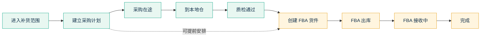
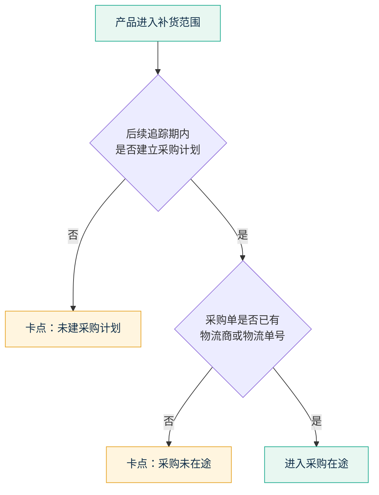
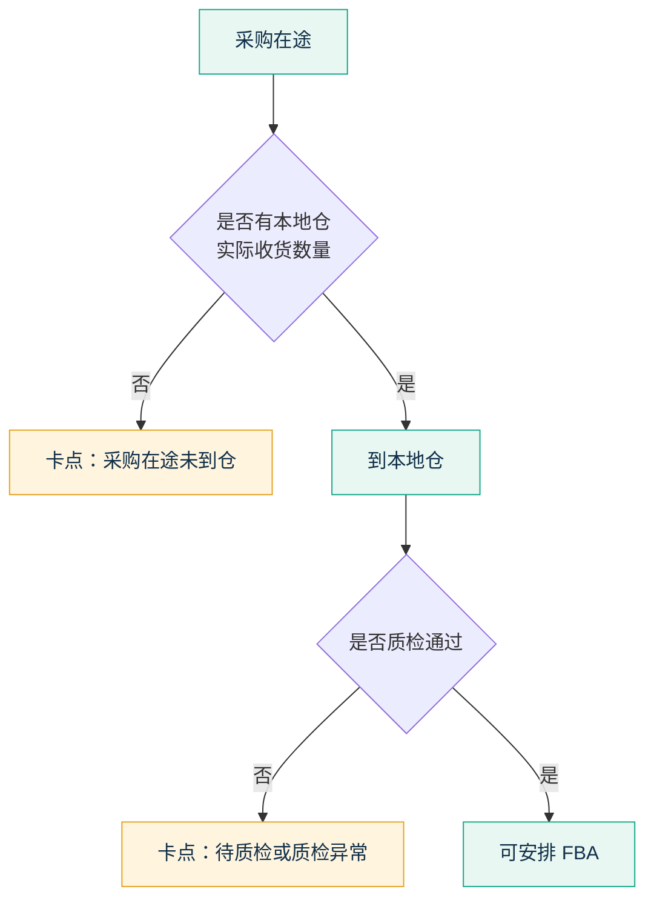
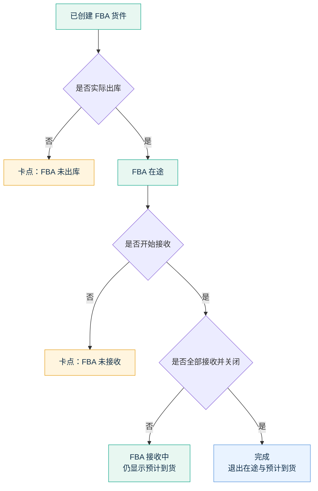
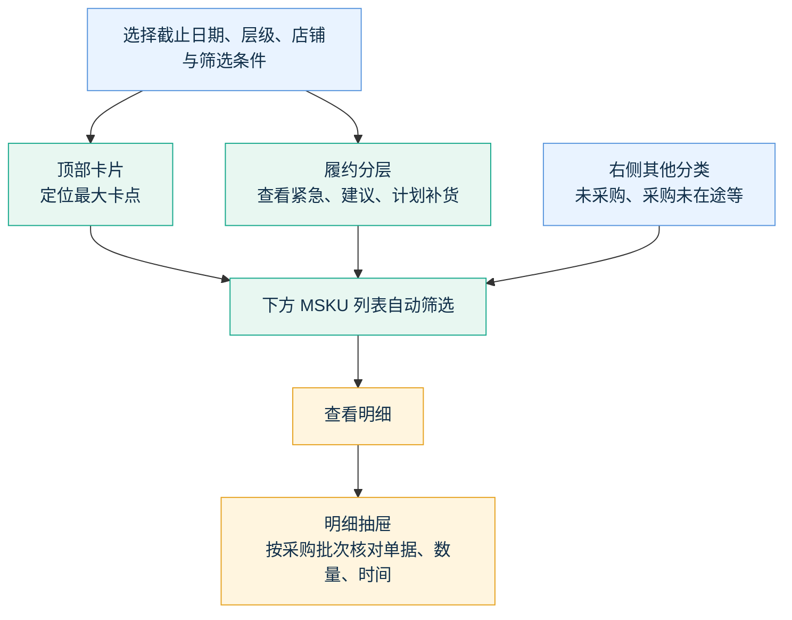

# 补货链路追踪：业务流程与页面说明

> 适用范围：每日补货看板中的采购/发货追踪，以及“补货链路追踪汇总”页面。
> 这份说明只解释业务口径、页面数字和操作方式，不涉及数据库或技术字段。

## 1. 这套追踪在看什么

补货建议出现后，页面持续追踪同一产品后续有没有被处理、货走到了哪里、卡在什么环节。

追踪对象是：**站点 + 店铺 + MSKU**。
SKU 用于在采购、仓库、质检和 FBA 单据之间核对是不是同一件商品。

完整主链路如下：



也可以按下面这条“直线”理解：

```text
进入补货范围
    ↓
建立采购计划
    ↓
采购在途（采购单已有物流）
    ↓
到本地仓（有实际收货）
    ↓
质检通过（有良品且无不良）
    ↓
创建 FBA 货件
    ↓
FBA 出库
    ↓
FBA 接收中
    ↓
全部接收完成
```

其中“提前创建 FBA”是主流程的一个业务分支：采购、到仓或质检尚未走完时，业务已经先建立了 FBA 发货计划。它会单独标记，但只要能明确对应本次采购，仍属于本次补货链路。

页面并不重新计算“今天建议补多少”，而是回答：

1. 这批需要补货的产品，后续有没有建采购？
2. 建采购后，是否真正开始运输、到本地仓、通过质检？
3. 是否创建了 FBA 货件、是否发出、是否被 FBA 接收？
4. 当前最需要跟进的卡点在哪里？

## 2. 两个页面分别怎么用

| 页面 | 用途 | 时间怎么理解 |
| --- | --- | --- |
| 每日补货看板 | 回看某一个补货日期的建议，后续是否有采购、发货等动作 | 选择补货日期后，观察其后的 7、14、30 天追踪窗口 |
| 补货链路追踪汇总 | 从供应链视角汇总历史补货池的整体履约进度 | “截止日期”表示数据看到哪一天；切换日期会回看当时的链路状态 |

### 汇总页中的“历史”和“当日”

- **历史**：截至截止日期，曾经进入过这个补货层级的去重 MSKU 数。
- **当日**：截止日期当天仍处于这个补货层级的 MSKU 数。
- 两者都是产品数量，不是补货数量，也不是采购数量。

例如“紧急补货：历史 175 个、当日 50 个”表示：截至该日，共有 175 个 MSKU 曾进入紧急补货；其中 50 个在当天仍是紧急补货。

## 3. 主链路的每一站怎么判断

### 3.1 需要补货 → 建立采购计划

**代表什么**：运营的补货需求已经被采购端响应。

**算已进入下一步的条件**：

- 产品进入紧急补货、建议补货或计划补货后；
- 在后续追踪期内，出现同站点、同店铺、同产品的采购计划。

**页面如何显示**：

- 已建采购：表示找到了补货之后创建的采购计划。
- 未建采购计划：表示追踪期内还没有找到对应采购计划。

**注意**：采购计划只是“准备采购”，并不表示供应商已经发货。

### 从补货到采购：判断图



---

### 3.2 建立采购计划 → 采购在途

**代表什么**：采购不只是计划，供应商已经安排了运输。

**算采购在途的条件**：

- 采购计划下已经有采购单；
- 采购单上有物流商或物流单号。

**页面如何显示**：

- 采购在途：已找到有物流信息的采购单。
- 采购未在途：已经建采购计划，但还没找到有物流信息的采购单。

**注意**：这里的“采购在途”是供应商发往本地仓的运输，不是发往 FBA 的在途。

---

### 3.3 采购在途 → 到本地仓

**代表什么**：货已经被本地仓实际收货。

**算到本地仓的条件**：

- 采购在途后，产生了对应的本地收货记录；
- 实际到仓数量大于 0。

**页面如何显示**：

- 到本地仓：有实际收货数量。
- 采购在途未到仓：已有物流，但还没有实际到仓记录。

---

### 3.4 到本地仓 → 质检通过

**代表什么**：到仓货物已完成质检，且可用库存可以继续进入 FBA 环节。

**算质检通过的条件**：

- 已有对应质检记录；
- 良品数量大于 0；
- 不良品数量为 0。

**页面如何显示**：

- 质检通过：本批货可以继续安排 FBA。
- 待质检 / 质检异常：还没有质检结果，或质检存在不良品。

### 从采购在途到可发 FBA：判断图



---

### 3.5 质检通过 → 创建 FBA 货件

**代表什么**：已经安排将本地仓货物发往 FBA。

业务上存在两种合理情况：

| 类型 | 说明 | 页面含义 |
| --- | --- | --- |
| 正常链路创建 | 采购到仓、质检通过后才创建 FBA 发货计划 | 表示按常规顺序推进 |
| 提前创建 | 采购计划刚创建，甚至货还未到本地仓时，就预先创建 FBA 发货计划 | 仍属于本次补货，只是提前安排货件 |

**两种情况共同要求**：发货计划需要能与本次采购计划对应到同一产品、店铺和站点，且数量处于合理范围内。

**页面如何显示**：

- 创建 FBA：包含正常链路创建和提前创建。
- 悬浮或抽屉中会拆分“正常链路”和“提前创建”的数量。
- 质检通过未建 FBA：采购链路已经走到可发 FBA，但尚未找到本次对应的 FBA 发货计划。

**重要说明**：提前创建不等于货已到本地仓，也不等于质检已通过。它只是提前安排了后续 FBA 货件。

---

### 3.6 创建 FBA 货件 → FBA 出库

**代表什么**：FBA 发货计划已经真正形成货件，并开始向 FBA 发运。

**算 FBA 出库的条件**：

- 已有 FBA 发货计划；
- 找到对应的真实 FBA 货件；
- 货件已有发货数量。

**页面如何显示**：

- FBA 出库：货件已经发出。
- FBA 未出库：已创建发货计划，但还没有真实发货动作。

---

### 3.7 FBA 出库 → FBA 接收 → 完成

| 阶段 | 代表什么 | 页面如何理解 |
| --- | --- | --- |
| FBA 未接收 | 货件已发出，FBA 尚未开始接收 | 仍在运输或等待入库 |
| FBA 接收中 | FBA 已接收部分数量，但未全部完成 | 货件仍会影响库存与预计到货 |
| 完成 | FBA 已完成接收并关闭货件 | 这条货件不再作为在途处理 |

**关键规则**：部分接收不算完成。只要还有未接收的发货数量，仍应保留在 FBA 在途和预计到货中。

### FBA 后半段：判断图



## 4. “当前节点”和“链路进度”怎么读

### 当前节点

“当前节点”表示：**当前尚未完成、下一步需要确认的环节**，不是货物现实中的物理位置。

例子：

- 已经有采购物流，但没有到仓记录：当前节点显示“到本地仓”。
- 已经到仓，但还没有质检通过：当前节点显示“质检通过”。
- 已创建 FBA 货件，但还未发出：当前节点显示“FBA 出库”。

### 链路进度图标

图标从左到右依次表示：

```text
采购计划 → 采购在途 → 到本地仓 → 质检通过 → 创建 FBA → FBA 出库 → FBA 接收
```

- 绿色：该环节已确认完成。
- 灰色：该环节尚未确认完成。
- 当前节点标签：提示当前需要跟进的地方。

## 5. 本次链路、提前创建与历史 FBA 的区别

这是页面最容易误读的部分。

### 本次链路

指能够从本次补货需求开始，顺着采购、收货、质检和 FBA 动作串起来的记录。

```text
补货建议 → 采购计划 → 采购单 → 到本地仓 → 质检 → FBA 发货计划 → FBA 货件
```

本次链路用于计算主页面上的节点转化和当前卡点。

### 提前创建 FBA

提前创建的 FBA 货件如果能对应到本次采购计划，仍属于本次链路；只是创建时间早于采购到仓或质检完成时间。

页面会单独提示，防止误解为“货已经到仓并完成质检”。

### 历史 / 待确认 FBA

以下情况会放在“历史 / 待确认 FBA”中单独展示：

- 在本次补货需求出现前就已存在的 FBA 发货计划或货件；
- 同一产品有 FBA 动作，但无法明确归到本次采购计划；
- 数量、产品、店铺或时间关系无法合理对应到本次采购链路。

历史 FBA 的作用是提示：它可能仍在运输、仍会影响库存；但它**不算作本次补货链路已经推进**，也不会提高本次主链路的完成率。

## 6. 数量怎么理解

不同环节的数量表示不同事实，不能直接互相替代。

| 页面数量 | 含义 |
| --- | --- |
| 补货建议数 | 看板建议补多少 |
| 采购计划数 | 采购计划准备采购多少 |
| 采购数量 | 采购单实际采购多少 |
| 到仓数量 | 本地仓实际收到多少 |
| 良品数量 | 质检后可继续使用多少 |
| FBA 计划数 | 计划发往 FBA 多少 |
| 发货数量 | 实际从本地仓发出多少 |
| FBA 接收数量 | FBA 已接收多少 |

采购计划、采购单和 FBA 货件可以拆单、合单或分批处理，因此出现一个产品对应多张单据是正常业务情况。页面保留这些记录，是为了方便核对真实流转。

## 7. 预计到货怎么理解

“最近预计到货”只看当前仍未全部接收的 FBA 在途货件。

### 会参与预计到货的货件

- 已经发出；
- 尚未全部被 FBA 接收；
- 没有关闭。

### 不参与预计到货的货件

- 已经全部接收；
- 已关闭；
- 没有实际发出。

### 同一产品有多个在途货件时

页面优先显示最快到货的一张有效货件：

1. 有未来预计到货日期时，取最近的未来日期；
2. 如果都已逾期，取最近一次逾期日期；
3. 没有有效在途货件时，显示 `-`。

“还有多少天到货”是相对于页面选择的**截止日期**计算，因此回看历史日期时，结果会随截止日期变化。

## 8. 汇总页面怎么读

### 页面联动图



### 顶部卡片

顶部卡片按当前卡点统计产品数：

| 卡片 | 它表示的问题 |
| --- | --- |
| 未建采购计划 | 需要补货，但还没有采购计划 |
| 采购未在途 | 已建采购计划，但还没有采购物流 |
| 采购在途未到仓 | 采购在路上，但本地仓还没有实际收货 |
| 质检通过未建 FBA | 货已可用，但还没有安排 FBA |
| FBA 未出库 | 已安排 FBA，但货件还没有发出 |
| FBA 未接收 | 已发出，FBA 还没有开始接收 |
| FBA 已完成 | FBA 已全部接收完成 |
| 历史 FBA 货件 | 仍会影响库存、但不属于本次主链路的历史货件 |

点击卡片会筛选下方产品列表。

### 履约分层

紧急补货、建议补货、计划补货分别展示：

- 历史出现产品数和当日产品数；
- 明星、潜力、瘦狗、问题产品的数量和占比；
- 建采购、采购在途、创建 FBA、FBA 出库等关键节点的转化情况。

节点卡片中的“已到达 / 前置池”表示：

```text
到达当前节点的 MSKU 数 / 可以进入该节点判断的 MSKU 数
```

点击节点卡片的“明细”，会打开对应节点的产品清单；点击右侧分类卡片，也会联动筛选下方列表。

### 产品列表

一行表示一个产品在所选截止日期下的综合追踪结果，可查看：

- 该产品曾命中的补货层级与当天层级；
- 首次进入补货、最近补货、出现天数；
- 销售角色；
- 建议数、当前节点、断点原因；
- 采购、到仓、质检、FBA 在途和预计到货情况；
- 单据摘要和“查看明细”。

## 9. 明细抽屉怎么读

点击“查看明细”后，抽屉用于核对单据与时间顺序。

### 链路总览

顶部按节点汇总：采购计划、采购单、到仓、质检、建 FBA、FBA 出库、FBA 接收。

数字既能看有多少张业务单据，也能看对应数量；用于快速判断是“没有动作”还是“有动作但数量不匹配”。

### 批次链路

主区域以采购计划为一个批次组织记录，并按业务顺序展示：

```text
采购计划 → 采购单 → 到本地仓 / 质检 → FBA
```

每张卡片会展示：

- 单号；
- 数量；
- 当前状态；
- 创建、采购、到仓、质检、发货等关键时间；
- 物流、仓库或货件信息（有数据时）。

### 历史 / 待确认 FBA

无法明确归到主采购批次的 FBA 记录，会放在独立区域。它不会干扰主链路判断，但能帮助供应链确认是否有历史在途或旧货件仍在影响库存。

## 10. 页面刷新后为什么会变化

补货建议和后续动作每天都可能变化：

```text
今天未建采购
→ 明天建立采购计划
→ 采购单补充物流后变为采购在途
→ 到本地仓并完成质检
→ 创建或提前创建 FBA
→ FBA 出库、接收、完成
```

因此同一个产品在不同截止日期下看到的状态可能不同，这是正常的历史回看结果。

页面依赖采购、仓库、质检和 FBA 单据的同步更新。刚创建的单据如果尚未同步到页面，可能暂时没有显示；待数据同步后会自动进入对应节点。

## 11. 快速判断几个常见问题

| 页面现象 | 业务解释 |
| --- | --- |
| 有采购计划但仍显示未采购 | 有计划不代表采购单已产生或已配置物流信息 |
| 有历史 FBA，但本次链路仍未建 FBA | 历史 FBA 不应替代本次补货的 FBA 动作 |
| 已建 FBA，但采购/质检未走完 | 可能是业务提前创建 FBA；需看是否标记为“提前创建” |
| 有 FBA 货件但没有预计到货 | 货件可能已全部接收、已关闭，或尚未实际发出 |
| 采购数量大于计划数量 | 可能发生拆单、合单、补单或一个采购单覆盖多个需求；需在抽屉按批次核对 |
| 一条产品有多张采购单、收货单或货件 | 真实业务可分批采购、分批到仓、分批发货；页面会保留多张单据供核对 |

## 12. 使用原则

1. 先看顶部卡片，定位当前最大的卡点。
2. 再按补货层级查看问题集中在哪一类需求。
3. 点击节点或分类卡片，筛出对应产品。
4. 对重点 MSKU 打开明细抽屉，按批次核对单号、数量和时间。
5. 历史 / 待确认 FBA 只用于判断库存影响，不把它当成本次补货已经完成。
